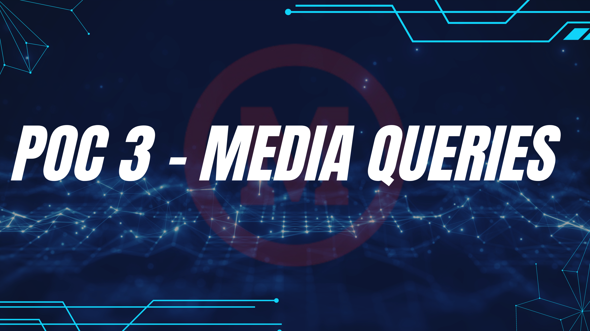

# POC-03

## Oque é media query?

Media Queries no CSS são uma técnica que permite aplicar estilos específicos a diferentes tamanhos de tela, dispositivos ou condições de exibição. Elas ajudam a tornar os sites responsivos, ou seja, adaptáveis a diferentes resoluções de tela, como smartphones, tablets e desktops.

### Print 

Com o media query, podemos mudar a forma com que a impressoara ve a pagina. Melhorando na hora da impressão e ajudando na salva de tinta.

Nossa pagina normalmente ==>


Com nossa pagina, na hora da impressão o usuario irá gastar muita tinta com este fundo vermelho. Por isso, usamos o @media print para facilitarmos para o usuario.


Agora a página esta com fundo branco e sem imagens.

Código:

``` css
/* Estilos para print (tudo preto) , quando for tirar uma impressão da pagina , ela vai ficar toda preta e letras em branco para imprimir  */
@media print {
    .bloco {
        background-color: black;
        color: white;
    }
    img {
        display: none;
}
```

### Largura de dispositivos 

Com o media query, podemos mudar a pagina web para cada dispositivo tablet, smartphone ou desktop. Com isso usamos @media(min-width ou max-width)

Para smartphones a pagina fica assim ==>


codigo:
```css
/* Estilos para dispositivos móveis (até 600px) onde vai mudar a cor do fundo para rosa e dimunuir tamanho da fonte  */
@media (max-width: 600px) {
    body {
        background-color: #009420;
    }
    img {
        height: 300px;
        width: 400px;
    }
    .bloco {
        max-width: 90%; 
        padding: 15px; 
    }
}
```

Para tablets a pagina fica assim ==>


codigo: 
```css
/* Estilos para tablets (entre 601px e 1024px) onde vai mudar cor do fundo para azul dimunuir tamanho da fonte e tamanho da imagem  */
@media (min-width: 601px) and (max-width: 1024px) {
    body {
        background-color: #0aa2fa;
    }
    img {
        height: 300px;
        width: 400px;
    }
    .bloco {
        max-width: 550px;
        padding: 15px;
    }
}
```

Para desktop a pagina fica assim ==>


codigo: 
```css
/* Estilos para desktops (acima de 1024px) padrão onde mantem a cor vermlha e tamanho mantido como padrão */
@media (min-width: 1025px) {
    body {
        background-color: #f50505;
    }
    img {
        height: 300px;
        width: 400px;
    }
}
```

### Disposição dos dispositivos 


#### Landscape

A media query orientation: landscape é usada no CSS para aplicar estilos específicos quando o dispositivo estiver em modo paisagem, ou seja, com a tela orientada horizontalmente, onde a largura é maior que a altura.


codigo:
```css
/* Estilos para orientação landscape para orientação horizontal (mais larga que alta), como uso do celular deitado  */
@media (orientation: landscape) {
    .bloco {
        background-color: #cef542;
    }/*Landscape (ou paisagem) é quando a largura da tela (lado horizontal) é maior que a altura (lado vertical) */
}

```

#### Portrait

A media query orientation: portrait é usada para aplicar estilos quando o dispositivo está em modo retrato, ou seja, quando a altura da tela é maior que a largura (a tela está na posição vertical).

Mudança no bloco de roxo para amarelo.


codigo:

```css
/* Estilos para orientação landscape para orientação horizontal (mais larga que alta), como uso do celular deitado  */
@media (orientation: landscape) {
    .bloco {
        background-color: #cef542;
    }/*Landscape (ou paisagem) é quando a largura da tela (lado horizontal) é maior que a altura (lado vertical) */
}
```

